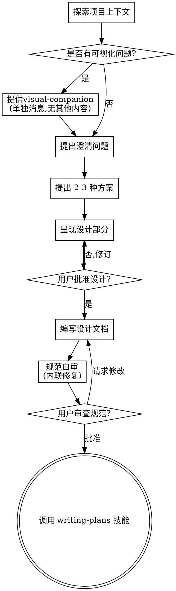

# 将创意brainstorming转化为设计

通过自然的协作对话，帮助将创意转化为完整的设计和规范。

首先理解当前项目上下文，然后逐一提问以完善创意。一旦理解了要构建的内容，呈现设计并获得用户批准。

<HARD-GATE>
在呈现设计并获得用户批准之前，不要调用任何实现技能、编写任何代码、搭建任何项目或采取任何实现行动。这适用于每个项目，无论看起来多么简单。
</HARD-GATE>

## 反模式："这太简单了不需要设计"

每个项目都必须经历这个过程。待办列表、单函数工具、配置修改——所有这些都包括在内。"简单"项目往往是未经验证的假设导致最多返工的地方。设计可以简短（对于真正简单的项目只需几句话），但你必须呈现设计并获得批准。

## 检查清单

你必须为以下每项创建任务并按顺序完成：

1. **探索项目上下文** — 检查文件、文档、最近的提交
2. **提供visual-companion**（如果主题将涉及可视化问题）— 这是单独的消息，不与澄清问题结合。参见下方的visual-companion部分。
3. **提出澄清问题** — 一次一个，理解目的/约束/成功标准
4. **提出 2-3 种方案** — 包含权衡取舍和你的推荐
5. **呈现设计** — 按复杂度分段呈现，每个部分后获得用户批准
6. **编写设计文档** — 保存到 `docs/clawt/specs/YYYY-MM-DD-<topic>-design.md` 并提交
7. **规范自审** — 快速内联检查占位符、矛盾、歧义、范围（见下文）
8. **用户审查书面规范** — 要求用户在继续之前审查规范文件
9. **过渡到实现** — 调用 writing-plans 技能创建实现计划

## 流程图

**终止状态是调用 writing-plans。** 不要调用 frontend-design、mcp-builder 或任何其他实现技能。brainstorming后你调用的唯一技能是 writing-plans。

## 流程

**理解创意：**

- 首先检查当前项目状态（文件、文档、最近的提交）
- 在提出详细问题之前，评估范围：如果请求描述了多个独立的子系统（例如"构建一个包含聊天、文件存储、账单和分析的平台"），立即标记。不要花时间完善需要先分解的项目细节。
- 如果项目对于单个规范来说太大，帮助用户分解为子项目：独立的部分有哪些、它们如何关联、应该按什么顺序构建？然后通过正常的设计流程对第一个子项目进行brainstorming。每个子项目都有自己的spec → plan → implementation循环。
- 对于范围适当的项目，逐一提问以完善创意
- 尽可能使用选择题，但开放式问题也可以
- 每条消息只问一个问题 - 如果某个主题需要更多探索，分解为多个问题
- 重点关注理解：目的、约束、成功标准

**探索方案：**

- 提出 2-3 种不同的方案及其权衡取舍
- 以对话方式呈现选项，给出你的推荐和理由
- 首先展示你推荐的选项并解释原因

**呈现设计：**

- 一旦你认为理解了要构建的内容，呈现设计
- 根据复杂度调整每个部分：简单的内容几句话，复杂的内容最多 200-300 字
- 每个部分后询问目前看起来是否正确
- 涵盖：架构、组件、数据流、错误处理、测试
- 准备好回头澄清不清楚的地方

**为隔离和清晰而设计：**

- 将系统分解为更小的单元，每个单元有单一明确的目的，通过定义良好的接口通信，并能独立理解和测试
- 对于每个单元，你应该能回答：它做什么、如何使用它、它依赖什么？
- 某人能否在不阅读内部实现的情况下理解单元的功能？能否在不破坏使用者的情况下更改内部实现？如果不能，边界需要改进。
- 更小、边界良好的单元也更容易让你处理 - 你能更好地推理可以一次性装入上下文的代码，当文件聚焦时你的编辑也更可靠。当文件变大时，这通常是它做了太多事情的信号。

**在现有代码库中工作：**

- 在提出变更之前探索当前结构。遵循现有模式。
- 在现有代码存在影响工作的问题的地方（例如文件变得太大、边界不清、职责混乱），将有针对性的改进作为设计的一部分 - 就像优秀的开发者在他们工作的代码中改进代码一样。
- 不要提出无关的重构。专注于服务于当前目标的内容。

## 设计之后

**文档化：**

- 将验证过的设计（规范）写入 `docs/clawt/specs/YYYY-MM-DD-<topic>-design.md`
- 如果可用，使用 elements-of-style:writing-clearly-and-concisely 技能
- 将设计文档提交到 git

**规范自审：**
编写规范文档后，用全新的眼光审视它：

1. **占位符扫描：** 是否有 "TBD"、"TODO"、不完整的部分或模糊的需求？修复它们。
2. **内部一致性：** 是否有部分互相矛盾？架构是否与功能描述匹配？
3. **范围检查：** 这是否足够聚焦以适合单个实现计划，还是需要分解？
4. **歧义检查：** 是否有任何需求可以有两种不同的解释？如果有，选择一种并明确说明。

内联修复任何问题。无需重新审查 — 只需修复并继续。

**用户审查关卡：**
规范审查循环通过后，要求用户在继续之前审查书面规范：

> "规范已编写并提交到 `<path>`。请审查它，在我们开始编写实现计划之前让我知道是否要进行任何更改。"

等待用户的响应。如果他们请求更改，进行更改并重新运行规范审查循环。仅在用户批准后才继续。

**实现：**

- 调用 writing-plans 技能创建详细的实现计划
- 不要调用任何其他技能。writing-plans 是下一步。

## 关键原则

- **一次一个问题** - 不要用多个问题让人不知所措
- **优先使用选择题** - 尽可能比开放式问题更容易回答
- **严格遵循 YAGNI** - 从所有设计中移除不必要的功能
- **探索替代方案** - 在确定之前始终提出 2-3 种方案
- **增量验证** - 呈现设计，在继续之前获得批准
- **保持灵活** - 当某些内容不清楚时回头澄清

## visual-companion

基于浏览器的companion，用于在brainstorming期间展示模型、图表和可视化选项。作为工具提供 — 而非模式。接受companion意味着它可以用于受益于可视化处理的问题；这并不意味着每个问题都通过浏览器处理。

**提供companion：** 当你预期即将到来的问题将涉及可视化内容（模型、布局、图表）时，提供一次以获得同意：
> "我们要处理的一些内容如果能在 Web 浏览器中向你展示可能会更容易解释。我可以组合模型、图表、比较和其他可视化内容。此功能仍然很新，可能会消耗大量 token。想试试吗？（需要打开本地 URL）"

**此提议必须是单独的消息。** 不要将其与澄清问题、上下文摘要或任何其他内容结合。消息应仅包含上述提议，别无其他。在继续之前等待用户的响应。如果他们拒绝，继续纯文本brainstorming。

**每个问题的决策：** 即使在用户接受后，也要针对每个问题决定是使用浏览器还是终端。测试标准：**用户通过看比阅读能更好地理解这个内容吗？**

- **使用浏览器** 处理可视化内容 — 模型、线框图、布局比较、架构图、并排可视化设计
- **使用终端** 处理文本内容 — 需求问题、概念选择、权衡列表、A/B/C/D 文本选项、范围决策

关于 UI 主题的问题并不自动成为可视化问题。"个性在此上下文中意味着什么？" 是一个概念问题 — 使用终端。"哪种向导布局更好？" 是一个可视化问题 — 使用浏览器。

如果他们同意使用companion，请在继续之前阅读详细指南：
`skills/brainstorming/visual-companion.md`
