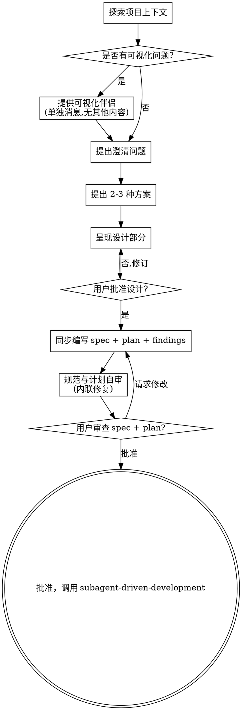

# 将创意头脑风暴转化为设计与实现计划

通过自然的协作对话，帮助将创意转化为完整的设计规范和实现计划。

首先理解当前项目上下文，然后逐一提问以完善创意。一旦理解了要构建的内容，呈现设计并获得用户批准，然后同步产出 spec 和 plan 两份文档。

## 两种调用场景

**场景 A：新增功能 / 未经过 systematic-debugging**（默认行为）
从零开始：探索上下文、澄清需求、产出 spec + plan，**同时新建 findings 文件**记录调研过程。

**场景 B：经过 systematic-debugging 之后**
根本原因已由 systematic-debugging 调查清楚，findings 文件已存在。此时 brainstorming 的职责是：
- 与用户讨论修复方案（2-3 种方案及权衡）
- 产出 spec 文档（修复目标、验收标准、回归测试要求）+ plan 文档
- **不新建 findings 文件**，如有新发现追加到已有文件

**如何判断当前场景：** 若 `docs/superpowers/findings/` 下已存在与本次任务相关的 findings 文件，则为场景 B。

<HARD-GATE>
在呈现设计并获得用户批准之前，不要调用任何实现技能、编写任何代码、搭建任何项目或采取任何实现行动。这适用于每个项目，无论看起来多么简单。
</HARD-GATE>

<HARD-GATE>
## 文件路径硬约束

所有输出文件**必须**严格遵循以下路径格式，禁止任何简化、缩写或自由发挥：

| 文件类型 | 路径格式 |
|---------|---------|
| Spec（设计文档） | `docs/superpowers/specs/YYYY-MM-DD-<topic>-design.md` |
| Findings（发现文档） | `docs/superpowers/findings/YYYY-MM-DD-<topic>-findings.md` |
| Plan（实现计划） | `docs/superpowers/plans/YYYY-MM-DD-<topic>.md` |

**路径各段说明：**
- `docs/superpowers/` — 固定前缀目录，**不可省略**
- `specs/` / `findings/` / `plans/` — 按文件类型分的子目录，**不可省略**
- `YYYY-MM-DD-` — 当日日期前缀（如 `2026-05-15-`），**不可省略**
- `<topic>` — 主题的 kebab-case slug（如 `upgrade-by-tag`），从任务主题自动生成
- `-design.md` / `-findings.md` — 固定后缀，**不可更改**（spec 文件后缀是 `-design.md` 不是 `-spec.md`）

**具体示例：**
- 主题 "upgrade by tag" + 日期 2026-05-15 →
  - Spec: `docs/superpowers/specs/2026-05-15-upgrade-by-tag-design.md`
  - Findings: `docs/superpowers/findings/2026-05-15-upgrade-by-tag-findings.md`
  - Plan: `docs/superpowers/plans/2026-05-15-upgrade-by-tag.md`

**写入前必须执行路径校验：** 在写文件之前，显式列出完整路径，逐段核对是否符合上表格式。路径不合规则**禁止写入**，必须修正后重试。
</HARD-GATE>

## 反模式："这太简单了不需要设计"

每个项目都必须经历这个过程。待办列表、单函数工具、配置修改——所有这些都包括在内。"简单"项目往往是未经验证的假设导致最多返工的地方。设计可以简短（对于真正简单的项目只需几句话），但你必须呈现设计并获得批准。

## 检查清单

你必须为以下每项创建任务并按顺序完成：

1. **探索项目上下文** — 检查文件、文档、最近的提交；
   - **场景 A（未经过 systematic-debugging）（新增功能）**：同时**新建 findings 文件**开始记录（路径必须为 `docs/superpowers/findings/YYYY-MM-DD-<topic>-findings.md`，见"文件路径硬约束"区块）
   - **场景 B（经过 systematic-debugging）（bug 修复）**：findings 文件已由 systematic-debugging 创建，**追加到已有文件**，不新建
2. **提供可视化伴侣**（如果主题将涉及可视化问题）— 这是单独的消息，不与澄清问题结合。参见下方的可视化伴侣部分。
3. **提出澄清问题** — 一次一个，理解目的/约束/成功标准；每次使用浏览器/搜索工具后更新 findings
4. **提出 2-3 种方案** — 包含权衡取舍和你的推荐；将技术决策及理由记入 findings
5. **呈现设计** — 按复杂度分段呈现，每个部分后获得用户批准
6. **编写设计文档与实现计划** — **先核对路径格式**（见"文件路径硬约束"区块），然后**同步**产出：
   - Spec 保存到 `docs/superpowers/specs/YYYY-MM-DD-<topic>-design.md`
   - Plan 保存到 `docs/superpowers/plans/YYYY-MM-DD-<topic>.md`
   - Findings 一并提交
   - 三份文件**一次性提交**到 git
7. **规范自审** — 快速内联检查占位符、矛盾、歧义、范围（见下文）；同步检查计划的占位符、规格覆盖、类型一致性
8. **用户审查书面规范与计划** — 要求用户在继续之前同时审查 spec 和 plan 文件
9. **过渡到实现** — 调用 `superpowers-subagent-driven-development`

## 流程图



**终止状态是调用 superpowers-subagent-driven-development。** 不得调用任何其他 skill，不得开始实现。头脑风暴后你调用的唯一 skill 是 `superpowers-subagent-driven-development`（需要用户批准 spec + plan 后才调用）。

## Findings 规范

Findings 文件与 spec、plan 文件并列产出，贯穿整个头脑风暴过程**持续更新**，不是最后才写。

### 文件路径

`docs/superpowers/findings/YYYY-MM-DD-<topic>-findings.md`

**此路径不可简化或缩写！** 必须包含 `superpowers/findings/` 子目录 + 日期前缀 + `-findings.md` 后缀。详见"文件路径硬约束"区块。

### 创建时机

在**第 1 步"探索项目上下文"开始时立即创建**，用空模板占位，边研究边填充。

### 强制更新规则

**每执行 2 次查看 / 浏览器 / 搜索操作后，必须更新 findings 文件。**
目的：防止视觉信息和调研结论滞留在上下文中后丢失。

### 强制记录内容

**技术决策必须记录理由：**

| 决策 | 理由 |
|------|------|
| 使用 Redis 做缓存 | 需要高频读写，内存缓存足够快 |

**遇到的问题必须记录解决方案：**

| 问题 | 解决方案 |
|------|---------|
| API 响应慢 | 添加 Redis 缓存层 |

**视觉 / 多模态内容立即文本化：**
看到任何图表、截图、UI 时，立即用文字记录关键信息，不依赖记忆。

### 文档模板

```markdown
# 发现与决策

## 需求
- [列出原始需求]

## 研究发现
- [记录调研结果]

## 技术决策
| 决策 | 理由 |
|------|------|
|      |      |

## 遇到的问题
| 问题 | 解决方案 |
|------|---------|
|      |         |

## 资源
- [有用的链接、文档、代码位置]

## 视觉 / 浏览器发现
<!-- 每执行 2 次查看/浏览器操作后必须更新此部分 -->
<!-- 多模态内容必须立即以文本形式记录 -->
- [看到的视觉内容文本化记录]

---
*每执行 2 次查看/浏览器/搜索操作后更新此文件*
```

### 提交时机

在**第 6 步编写设计文档与实现计划时随 spec、plan 一起提交**。

## 流程

**理解创意：**

- 首先检查当前项目状态（文件、文档、最近的提交）
- 在提出详细问题之前，评估范围：如果请求描述了多个独立的子系统（例如"构建一个包含聊天、文件存储、账单和分析的平台"），立即标记。不要花时间完善需要先分解的项目细节。
- 如果项目对于单个规范来说太大，帮助用户分解为子项目：独立的部分有哪些、它们如何关联、应该按什么顺序构建？然后通过正常的设计流程对第一个子项目进行头脑风暴。每个子项目都有自己的规范 → 计划 → 实现循环。
- 对于范围适当的项目，逐一提问以完善创意
- 尽可能使用选择题，但开放式问题也可以
- 每条消息只问一个问题 - 如果某个主题需要更多探索，分解为多个问题
- 重点关注理解：目的、约束、成功标准

**探索方案：**

- 提出 2-3 种不同的方案及其权衡取舍
- 以对话方式呈现选项，给出你的推荐和理由
- 首先展示你推荐的选项并解释原因

**呈现设计：**

- 一旦你认为理解了要构建的内容，呈现设计
- 根据复杂度调整每个部分：简单的内容几句话，复杂的内容最多 200-300 字
- 每个部分后询问目前看起来是否正确
- 涵盖：架构、组件、数据流、错误处理、测试
- 准备好回头澄清不清楚的地方

**为隔离和清晰而设计：**

- 将系统分解为更小的单元，每个单元有单一明确的目的，通过定义良好的接口通信，并能独立理解和测试
- 对于每个单元，你应该能回答：它做什么、如何使用它、它依赖什么？
- 某人能否在不阅读内部实现的情况下理解单元的功能？能否在不破坏使用者的情况下更改内部实现？如果不能，边界需要改进。
- 更小、边界良好的单元也更容易让你处理 - 你能更好地推理可以一次性装入上下文的代码，当文件聚焦时你的编辑也更可靠。当文件变大时，这通常是它做了太多事情的信号。

**在现有代码库中工作：**

- 在提出变更之前探索当前结构。遵循现有模式。
- 在现有代码存在影响工作的问题的地方（例如文件变得太大、边界不清、职责混乱），将有针对性的改进作为设计的一部分 - 就像优秀的开发者在他们工作的代码中改进代码一样。
- 不要提出无关的重构。专注于服务于当前目标的内容。

## 设计之后：同步产出 spec + plan

用户批准设计后，**同时**编写以下三份文档：

### Spec 文档

将验证过的设计写入 `docs/superpowers/specs/YYYY-MM-DD-<topic>-design.md`

**此路径不可简化或缩写！** 必须包含 `superpowers/specs/` 子目录 + 日期前缀 + `-design.md` 后缀。详见"文件路径硬约束"区块。

### Plan 文档

将实现计划写入 `docs/superpowers/plans/YYYY-MM-DD-<topic>.md`

Plan 文档假设工程师对代码库零了解且品味存疑，记录他们需要知道的一切：每个任务需要触及哪些文件、代码、测试，以及如何测试。以小粒度任务形式给出整个计划。DRY。YAGNI。TDD。频繁提交。

#### 范围检查

如果规格说明涵盖多个独立的子系统，建议将其分解为单独的计划 — 每个子系统一个计划。每个计划都应该能独立产生可工作、可测试的软件。

#### 文件结构规划

在定义任务之前，规划出将要创建或修改哪些文件以及每个文件的职责：

- 设计具有清晰边界和明确定义接口的单元，每个文件一个职责
- 优先选择较小的、聚焦的文件，而不是做太多事情的大型文件
- 一起变化的文件放在一起，按职责分离而不是按技术层分离
- 在现有代码库中，遵循既定模式；如果要修改的文件已经变得笨重，在计划中包含拆分是合理的

#### 任务粒度

**每个步骤是一个动作（2-5 分钟）：**
- "编写失败的测试" - 步骤
- "运行它以确保它失败" - 步骤
- "实现使测试通过的最小代码" - 步骤
- "运行测试并确保它们通过" - 步骤
- "提交" - 步骤

#### Plan 文档头部

**每个计划必须以此头部开始：**

```markdown
# [Feature Name] Implementation Plan

> **For agentic workers:** REQUIRED SUB-SKILL: Use superpowers-subagent-driven-development to implement this plan task-by-task. Steps use checkbox (`- [ ]`) syntax for tracking.

**Goal:** [One sentence describing what this builds]

**Architecture:** [2-3 sentences about approach]

**Tech Stack:** [Key technologies/libraries]

---
```

#### 任务结构模板

````markdown
### Task N: [Component Name]

**Files:**
- Create: `exact/path/to/file.py`
- Modify: `exact/path/to/existing.py:123-145`
- Test: `tests/exact/path/to/test.py`

- [ ] **Step 1: Write the failing test**

```python
def test_specific_behavior():
    result = function(input)
    assert result == expected
```

- [ ] **Step 2: Run test to verify it fails**

Run: `pytest tests/path/test.py::test_name -v`
Expected: FAIL with "function not defined"

- [ ] **Step 3: Write minimal implementation**

```python
def function(input):
    return expected
```

- [ ] **Step 4: Run test to verify it passes**

Run: `pytest tests/path/test.py::test_name -v`
Expected: PASS

- [ ] **Step 5: Commit**

```bash
git add tests/path/test.py src/path/file.py
git commit -m "feat: add specific feature"
```
````

#### 禁止占位符

每个步骤必须包含工程师需要的实际内容。这些是**计划失败** — 永远不要写它们：
- "TBD"、"TODO"、"implement later"、"fill in details"
- "添加适当的错误处理" / "添加验证" / "处理边界情况"
- "为上述编写测试"（没有实际的测试代码）
- "类似于任务 N"（重复代码 — 工程师可能不按顺序阅读任务）
- 描述做什么而不展示如何做的步骤（代码步骤需要代码块）
- 引用未在任何任务中定义的类型、函数或方法

### 自审

编写完 spec 和 plan 后，用全新的眼光同时审视两份文档：

**Spec 自审：**
1. **占位符扫描：** 是否有 "TBD"、"TODO"、不完整的部分或模糊的需求？修复它们。
2. **内部一致性：** 是否有部分互相矛盾？架构是否与功能描述匹配？
3. **范围检查：** 是否足够聚焦以适合单个实现计划，还是需要分解？
4. **歧义检查：** 是否有任何需求可以有两种不同的解释？如果有，选择一种并明确说明。

**Plan 自审：**
1. **规格覆盖：** 快速浏览 spec 中的每个需求，能指出实现它的任务吗？列出任何缺口。
2. **占位符扫描：** 搜索上文"禁止占位符"中的任何模式，修复它们。
3. **类型一致性：** 后续任务中使用的类型、方法签名、属性名是否与早期任务中定义的匹配？

内联修复任何问题，无需重新审查。

### 用户审查关卡

自审通过后，要求用户同时审查 spec 和 plan：

> "spec 和 plan 已编写并提交：
> - Spec: `<spec-path>`
> - Plan: `<plan-path>`
>
> 请审查这两份文档，在我们开始实现之前让我知道是否要进行任何更改。"

等待用户响应。如果请求更改，修改对应文档并重新运行自审。仅在用户批准后才继续。

### 实现

<HARD-GATE>
用户批准 spec + plan 后，**下一步必须是 `superpowers-subagent-driven-development`**。不得调用任何其他 skill，不得开始实现。

调用 `superpowers-subagent-driven-development` 前必须等待用户明确批准。
</HARD-GATE>

## 关键原则

- **一次一个问题** - 不要用多个问题让人不知所措
- **优先使用选择题** - 尽可能比开放式问题更容易回答
- **严格遵循 YAGNI** - 从所有设计中移除不必要的功能
- **探索替代方案** - 在确定之前始终提出 2-3 种方案
- **增量验证** - 呈现设计，在继续之前获得批准
- **保持灵活** - 当某些内容不清楚时回头澄清

## 可视化伴侣

基于浏览器的伴侣，用于在头脑风暴期间展示模型、图表和可视化选项。作为工具提供 — 而非模式。接受伴侣意味着它可以用于受益于可视化处理的问题；这并不意味着每个问题都通过浏览器处理。

**提供伴侣：** 当你预期即将到来的问题将涉及可视化内容（模型、布局、图表）时，提供一次以获得同意：
> "我们要处理的一些内容如果能在 Web 浏览器中向你展示可能会更容易解释。我可以组合模型、图表、比较和其他可视化内容。此功能仍然很新，可能会消耗大量 token。想试试吗？（需要打开本地 URL）"

**此提议必须是单独的消息。** 不要将其与澄清问题、上下文摘要或任何其他内容结合。消息应仅包含上述提议，别无其他。在继续之前等待用户的响应。如果他们拒绝，继续纯文本头脑风暴。

**每个问题的决策：** 即使在用户接受后，也要针对每个问题决定是使用浏览器还是终端。测试标准：**用户通过看比阅读能更好地理解这个内容吗？**

- **使用浏览器** 处理可视化内容 — 模型、线框图、布局比较、架构图、并排可视化设计
- **使用终端** 处理文本内容 — 需求问题、概念选择、权衡列表、A/B/C/D 文本选项、范围决策

关于 UI 主题的问题并不自动成为可视化问题。"个性在此上下文中意味着什么？" 是一个概念问题 — 使用终端。"哪种向导布局更好？" 是一个可视化问题 — 使用浏览器。

如果他们同意使用伴侣，请在继续之前阅读详细指南：
`skills/superpowers-brainstorming/visual-companion.md`
